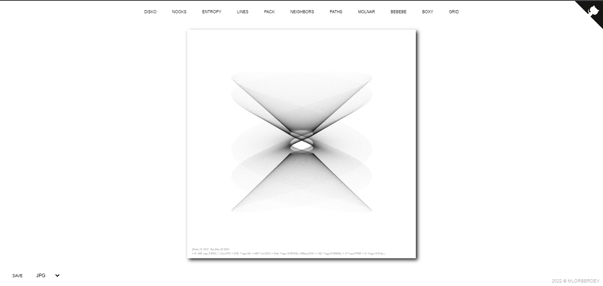
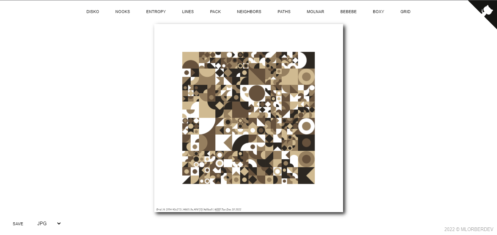
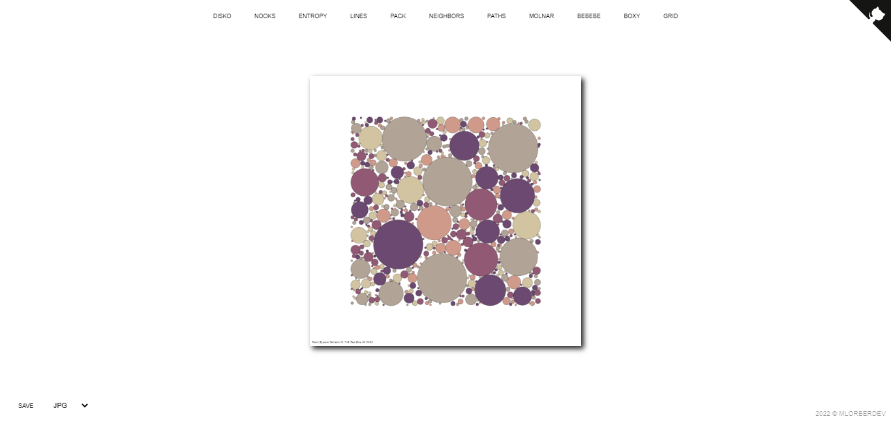
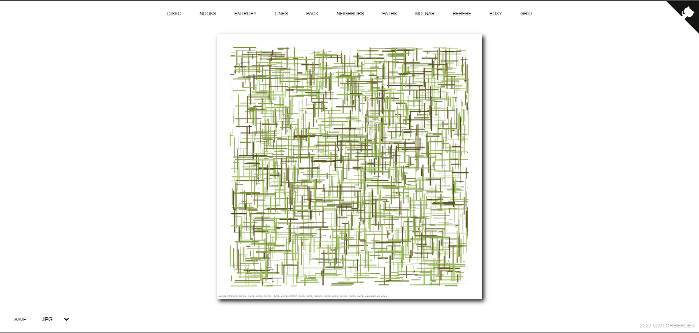
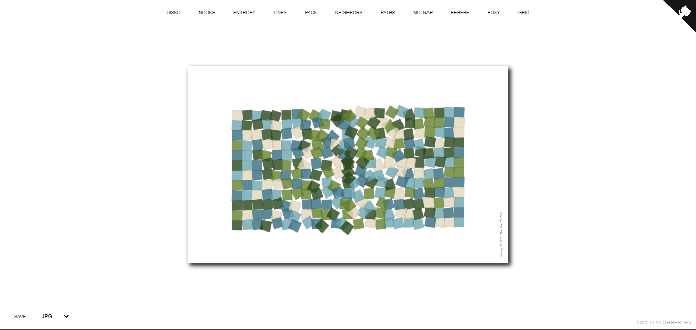

# Generative-Art

This is a collection of generative art projects coded in JavaScript ES2022 modules as an exercise. Inspiration for each piece comes from some of the first-gen artists working in this medium; and, the coding is how I imagine they could have done it with modern tools.

## Use

The project is deployed at [https://mlorberdev-generative-art.netlify.app/](https://mlorberdev-generative-art.netlify.app/). Just click a button at the top to run the corresponding program; lock in a palette if you like; select a download type from the dropdown at the top-left and click save.

## Screenshots

### Sample

### Sample

### Sample

### Sample

### Sample

### Sample

## License
2022 [CC BY 3.0](https://creativecommons.org/licenses/by/3.0/) attribution required.