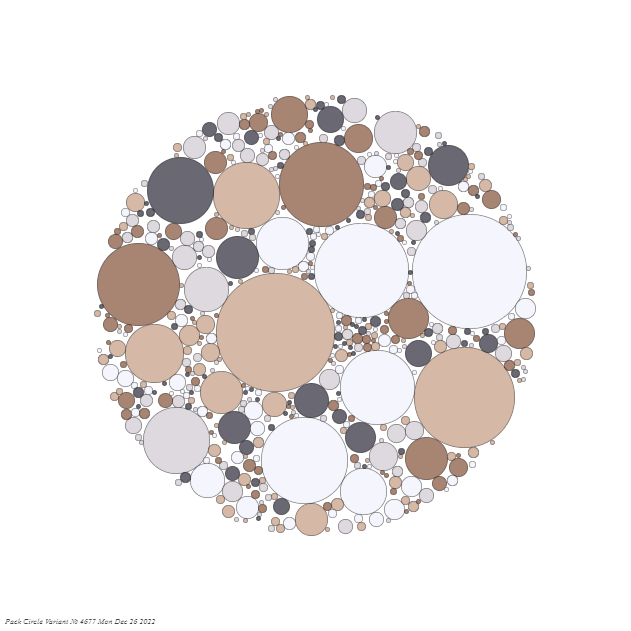
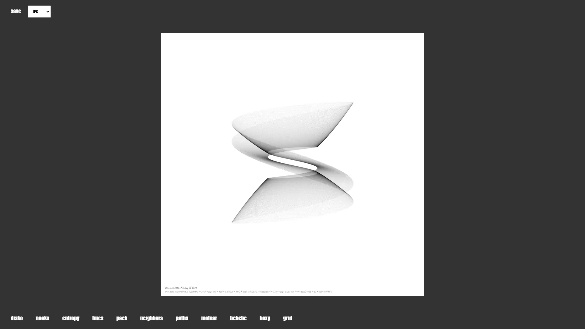
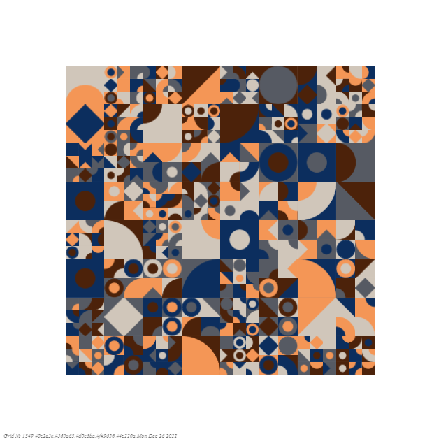
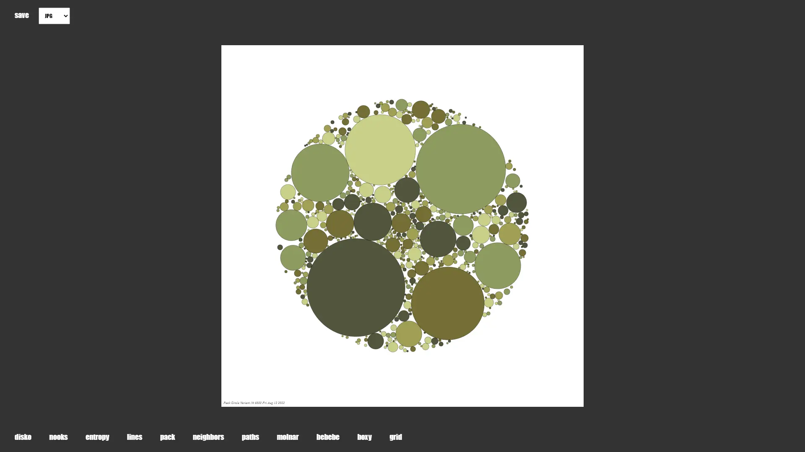
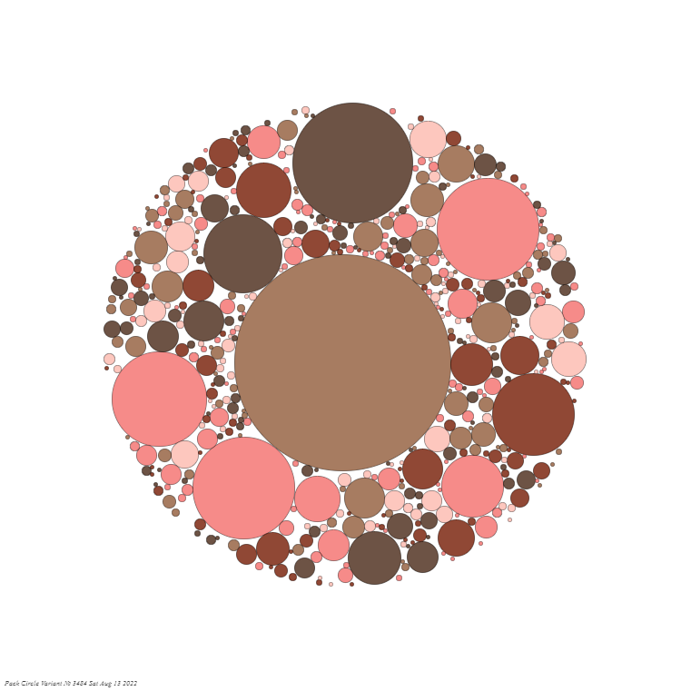

# Generative-Art

This is a collection of past vanilla JavaScript generative art projects, duplicating or elaborating on some of the first generation artists' work by analyzing & synthesizing their apparent algorithms. No libraries or outside sources were used or consulted while undertaking this project. This gallery will generate a random work each time one of the script buttons is clicked.

[Homepage](https://mlorberdev-generative-art.netlify.app/)

## Screenshots

### Sample

### Sample

### Sample

### Sample

### Sample

## License
[MIT](https://choosealicense.com/licenses/mit/)